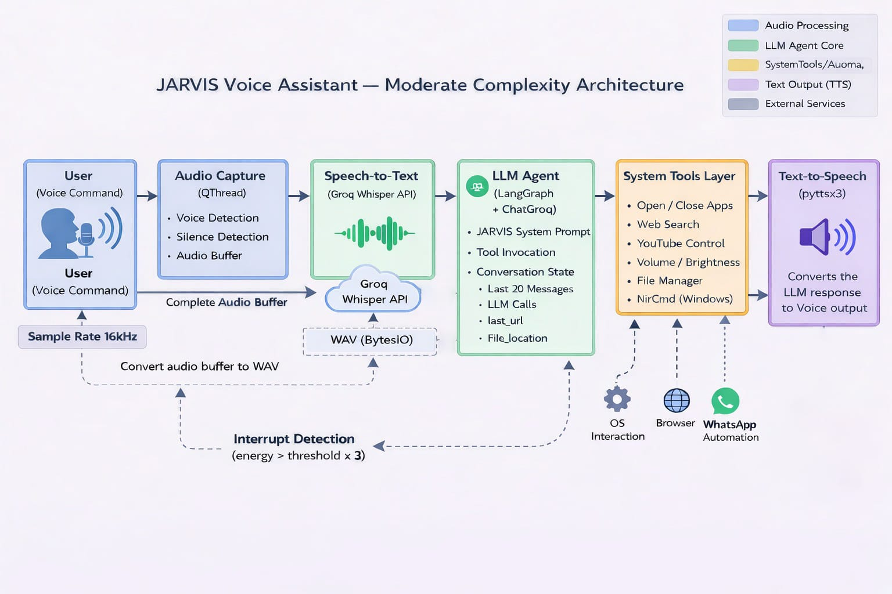

# J.A.R.V.I.S — Personal AI Assistant

<div align="center">

**An intelligent, voice-driven desktop assistant combining real-time speech recognition, LLM reasoning, and system-level automation.**

[](https://www.python.org/)
[](https://www.langchain.com/langgraph)
[](https://groq.com/)
[](https://pypi.org/project/PyQt5/)
[](#license)

</div>

---

## Overview

**JARVIS** is a voice-activated desktop AI assistant that listens, reasons, and *acts*. Instead of behaving like a passive chatbot, it interprets natural spoken language and dynamically decides whether to reply conversationally or execute a real system-level task — opening apps, adjusting volume and brightness, managing files, controlling YouTube, searching the web, or reading unread WhatsApp messages.

It's built around a tool-augmented LLM agent (LangGraph + ChatGroq), so instead of matching rigid keywords, JARVIS understands *intent* — and remembers context, so a follow-up like *"open that link"* or *"increase it to 70%"* just works.

> Developed as a final year academic project — *J.A.R.V.I.S – Personal AI Assistant*, B.Sc. Data Analytics, Guru Nanak College (Autonomous), Chennai.

---

## Table of Contents

- [Features](#features)
- [Architecture](#architecture)
- [Tech Stack](#tech-stack)
- [Getting Started](#getting-started)
- [Usage](#usage)
- [Project Modules](#project-modules)
- [Testing & Validation](#testing--validation)
- [Roadmap](#roadmap)
- [Contributing](#contributing)
- [License](#license)
- [Acknowledgements](#acknowledgements)

---

## Features

| Category | Capability |
|---|---|
| 🎙️ **Voice Interaction** | Continuous, energy-threshold-based speech detection with real-time transcription |
| 🧠 **Contextual Reasoning** | LLM-powered intent understanding with conversational memory (last 20 messages, last URL, last file location) |
| 🛠️ **App Control** | Open / close desktop applications by name, with web fallback if not installed |
| 🔊 **System Settings** | Voice-controlled volume and brightness adjustment |
| 🖥️ **Window & Desktop Management** | Minimize, maximize, switch windows, create/switch virtual desktops |
| 📁 **File Manager** | List, open, and navigate files/folders through natural voice commands |
| 🌐 **Web Search** | Google & DuckDuckGo search integration with link recall (*"open that link"*) |
| ▶️ **YouTube Control** | Search, play, and pause YouTube videos hands-free |
| 💬 **WhatsApp Integration** | Retrieve unread WhatsApp Web messages via Selenium automation |
| ⚡ **Interrupt Handling** | Stops mid-response instantly if the user starts speaking again |
| 🖼️ **Live GUI** | PyQt5 interface showing listening state, latency, uptime, and conversation canvas |

---

## Architecture

JARVIS follows a five-layer pipeline — **Input → Processing → Intelligence → Execution → Output** — with every stage running on its own thread to stay responsive and non-blocking.



**Flow summary:**

1. **Audio Capture** *(QThread)* — records mic input at 16kHz, detects voice/silence, buffers audio
2. **Speech-to-Text** — buffered audio is converted to WAV and transcribed via the **Groq Whisper API**
3. **LLM Agent Core** *(LangGraph + ChatGroq)* — interprets intent, maintains conversation state (recent messages, last URL, last file path), and decides: respond, or call a tool
4. **System Tools Layer** — executes the selected tool: app control, web search, YouTube control, volume/brightness, file manager, or NirCmd-based Windows operations
5. **Text-to-Speech** *(pyttsx3)* — converts the LLM's response into spoken audio output

An **interrupt detection loop** (audio energy > threshold × 3) continuously listens even during TTS playback, so a new command instantly cancels the current response.

---

## Tech Stack

**Core Language**
- Python 3.10+

**Speech & Audio**
- Groq Whisper API — cloud speech-to-text
- `sounddevice`, `NumPy` — audio capture & energy-based voice detection
- `pyttsx3` — offline text-to-speech synthesis

**AI / Reasoning**
- `LangChain` + `LangGraph` — agent orchestration and stateful tool-calling
- `ChatGroq` — LLM inference backend

**Automation & System Control**
- `AppOpener` — application open/close
- `PyAutoGUI` — keyboard/mouse and window automation
- `screen_brightness_control` — brightness control
- `NirCmd` — Windows system volume control
- `os`, `subprocess`, `pathlib` — file and OS-level operations

**Web & Messaging**
- `requests`, `BeautifulSoup` — web search & scraping
- `webbrowser`, `urllib` — URL handling
- `Selenium` — WhatsApp Web automation

**Interface**
- `PyQt5` (`QThread`, signals/slots) — responsive multi-threaded GUI

---

## Getting Started

### Prerequisites

| Requirement | Minimum | Recommended |
|---|---|---|
| OS | Windows 10 | Windows 11 |
| Processor | Intel i5 (8th Gen) | Intel i7 / Ryzen 7+ |
| RAM | 8 GB | 16 GB+ |
| Storage | 20 GB free | 256 GB SSD |
| Microphone / Speakers | Required | — |
| GPU | — | NVIDIA (CUDA) for local model inference |
| Internet | Required (Groq API calls) | — |

### Installation

```bash
# 1. Clone the repository
git clone https://github.com/<your-username>/jarvis-ai-assistant.git
cd jarvis-ai-assistant

# 2. Create and activate a virtual environment
python -m venv venv
venv\Scripts\activate      # Windows
# source venv/bin/activate # macOS/Linux

# 3. Install dependencies
pip install -r requirements.txt
```

### Configuration

Set your API keys as environment variables before running (never commit these to source control):

```bash
set GROQ_API_KEY=your_groq_api_key_here
```

Ensure [`NirCmd.exe`](https://www.nirsoft.net/utils/nircmd.html) is available on your system `PATH` for volume control on Windows.

### Run

```bash
python main.py
```

---

## Usage

Once running, JARVIS listens continuously. Some example commands:

```
"Open Chrome"
"Set the volume to 60%"
"Set brightness to 40%"
"Search for Python tutorials"
"Open that link"
"Play [song name] on YouTube"
"Pause it"
"What's on my D drive?"
"Do I have any WhatsApp messages?"
"Close Spotify"
```

JARVIS resolves contextual references (*"it"*, *"that link"*) using its short-term conversation memory, so multi-step conversations feel natural rather than command-by-command.

---

## Project Modules

| Module | Responsibility |
|---|---|
| **Audio Capture** | Continuous mic monitoring, speech/silence detection, buffering |
| **Speech-to-Text** | Converts audio to text via Groq Whisper |
| **LLM Agent Core** | Intent interpretation, tool selection, conversational memory |
| **Tool Execution** | App control, file manager, web search, YouTube, system settings |
| **Text-to-Speech** | Converts responses to speech, with interrupt handling |
| **Conversation Memory** | Tracks last 20 messages, last URL, last file location |
| **User Interface** | PyQt5 GUI — status, logs, conversation canvas |
| **System Automation** | Direct OS-level control (volume, brightness, windows, desktops) |

---

## Testing & Validation

The system was validated across multiple layers:

- **Unit Testing** — each module (audio capture, STT, reasoning, tool execution, TTS) tested in isolation for accuracy, latency, and error handling
- **System Testing** — full end-to-end voice-command-to-response pipeline validated, including multi-threading and interrupt handling
- **Acceptance Testing** — real-world natural-language commands tested for usability, response clarity, and contextual accuracy
- **Stress & Reliability Testing** — long sessions, rapid consecutive commands, and simulated API/network failures to confirm graceful degradation

---

## Roadmap

- [ ] Persistent session history with searchable logs
- [ ] Companion mobile app for remote control
- [ ] Smart home / IoT device integration
- [ ] Multi-language speech recognition & synthesis
- [ ] Adaptive personalization based on usage patterns
- [ ] Encrypted cloud sync across devices

---

## Contributing

Contributions, issues, and feature requests are welcome. Feel free to check the [issues page](../../issues) or open a pull request.

1. Fork the repository
2. Create your feature branch (`git checkout -b feature/amazing-feature`)
3. Commit your changes (`git commit -m 'Add amazing feature'`)
4. Push to the branch (`git push origin feature/amazing-feature`)
5. Open a Pull Request

---

## License

Distributed under the MIT License. See `LICENSE` for more information.

---

## Acknowledgements

- Developed by **Varshan N** — B.Sc. Data Analytics, Guru Nanak College (Autonomous), Chennai
- Built with [OpenAI Whisper](https://github.com/openai/whisper), [LangChain](https://docs.langchain.com/), [LangGraph](https://www.langchain.com/langgraph), and [Groq](https://groq.com/)
